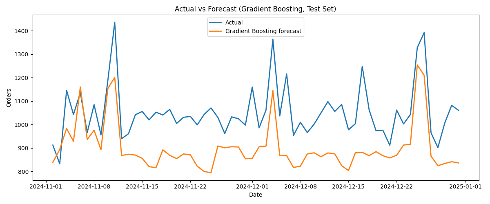
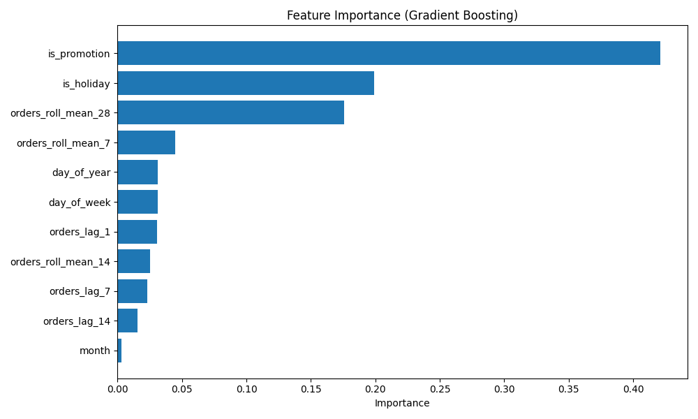
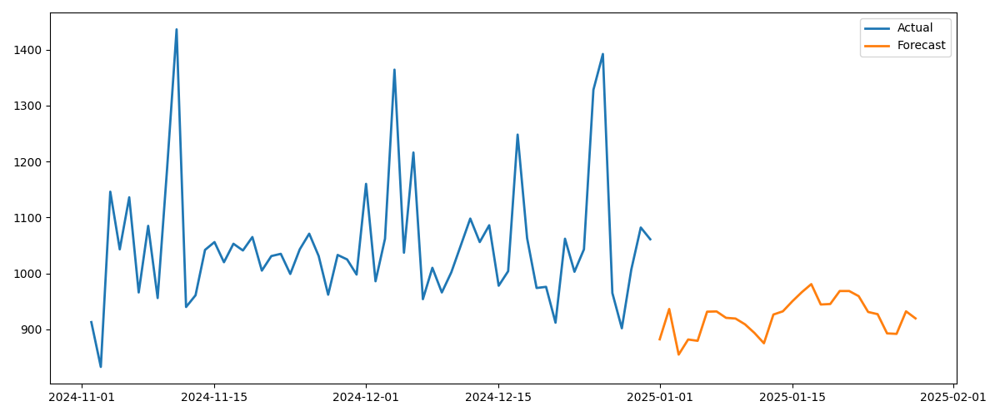

# AI Demand Forecasting for Logistics 🚚📈

[](https://www.python.org/)
[](LICENSE)

End-to-end demand forecasting pipeline for logistics and supply chain operations.  
Built to showcase **senior-level data science and production thinking** for roles at Amazon, Google, Microsoft, and large logistics organizations.

---

## Key Highlights

- **End-to-end pipeline**  
  From raw daily data → feature engineering → multiple models → evaluation → visualizations → 28‑day forecast.

- **Business-driven forecasting**  
  Designed around real logistics decisions: staffing, warehouse capacity, linehaul planning, and cost-to-serve.

- **Time-series + machine learning**  
  Combines baselines, classical time-series (SARIMAX), and Gradient Boosting with lag/rolling features.

- **Operational and financial impact**  
  Connects error metrics (MAPE, RMSE, sMAPE) to stockouts, expedites, labor cost, and annual € savings.

- **Modular, production-oriented design**  
  Clean `src/` package, synthetic data generator, CLI-style entry points, and clear paths to API/automation.

---

## 1. Problem Overview

Objective: forecast **daily shipment volume** for the next **28 days** for a logistics operation  
(e.g., parcel network, e‑commerce fulfillment center, or regional linehaul).

Characteristics:

- ~3 years of **daily** history
- Strong **weekly seasonality** (weekday vs weekend)
- **Trend** from business growth
- **Promotion** and **holiday** effects
- Realistic random variability

In the code, the target column is `orders`, representing daily **shipments**.

We treat this as a **time-series forecasting** and **supervised regression** problem with a **time-aware train/validation/test split**.

---

## 2. Why Forecasting Matters in Logistics

Better shipment forecasts directly impact:

### 2.1 Staffing

- Dock workers per shift (inbound / outbound)
- Number of active lines in sortation centers
- Customer service headcount for expected ticket volume

**Under-forecast** → overtime, burnout, missed SLAs  
**Over-forecast** → idle labor, higher cost per shipment

### 2.2 Warehouse Capacity and Slotting

- Required pallets, bins, and floor space
- Slotting for high-volume routes/customers/SKUs
- Putaway and picking wave design

Bad forecasts create either **stockouts and chaos**, or **excess inventory and working capital drag**.

### 2.3 Linehaul and Transport Planning

- Linehaul schedules (how many trucks, when they depart)
- Route consolidation vs direct lanes
- Primary vs backup carrier mix

Good forecasts enable:

- Earlier booking → better transport rates
- Higher fleet utilization
- Fewer last-minute expedited movements

### 2.4 Cost-to-Serve

Forecast accuracy flows into **cost-to-serve** via:

- Labor (overtime, temps, churn)
- Transport (expedites, underloaded trucks)
- Penalties and SLA fees
- Lost margin from stockouts and late deliveries

This project is built to make those trade-offs easy to discuss in interviews.

---

## 3. Project Structure

```text
ai-demand-forecasting-logistics/
├── README.md
├── requirements.txt
├── Makefile
├── .gitignore
├── data/
│   ├── raw/
│   │   └── synthetic_demand.csv
│   └── processed/
├── notebooks/
│   └── 01_eda_and_baseline.ipynb
└── src/
    ├── __init__.py
    ├── data.py
    ├── features.py
    ├── evaluate.py
    ├── train.py
    └── forecast.py
```

- `README.md` – business framing, technical overview, usage
- `data/` – raw and processed data (contents are gitignored)
- `notebooks/` – EDA and baseline analysis
- `src/` – reusable Python package (data/feature/model code)
- `requirements.txt` – Python dependencies
- `Makefile` – convenience commands (`make data`, `make train`, `make forecast`)

---

## 4. Data

### 4.1 Synthetic Dataset

To keep the project **self-contained and fast on a laptop**, the default dataset is **synthetic** but structured like real shipment data.

Baseline columns:

- `date` – calendar date  
- `orders` – daily shipment volume (target)  
- `is_promotion` – promotion flag (0/1)  
- `is_holiday` – simplified holiday flag (0/1)

Synthetic data includes:

- Linear trend (growth)
- Weekly pattern (Mon–Fri vs weekend)
- Uplifts for holidays and promotions
- Random noise

Generate data:

```bash
make data
# or
python -m src.data
```

You can later plug in a **real dataset** (e.g., order-level or lane-level shipments) by modifying `src/data.py` to load from your own CSV while reusing the rest of the pipeline.

---

## 5. Features and Models

### 5.1 Feature Engineering

From the raw daily series, the pipeline builds:

- **Calendar features**
  - `day_of_week`
  - `month`
  - `day_of_year`
  - `is_holiday`
  - `is_promotion`

- **Lag features** (target = `orders` / shipments)
  - `orders_lag_1`
  - `orders_lag_7`
  - `orders_lag_14`

- **Rolling-window features**
  - `orders_roll_mean_7`
  - `orders_roll_mean_14`
  - `orders_roll_mean_28`

Implementation: `src/features.py`.

### 5.2 Models

All models use a **time-based** train/validation/test split (no random shuffling).

1. **Baselines**

   - **Naive** – forecast for today = shipments from yesterday (`orders_lag_1`)  
   - **Seasonal naive** – forecast for today = shipments from 7 days ago (`orders_lag_7`)

   Baselines provide a realistic “no-ML” benchmark.

2. **Classical time-series model**

   - **SARIMAX** (`statsmodels`)  
   - Captures trend and weekly seasonality directly on the univariate shipment series.

3. **Machine learning model**

   - **GradientBoostingRegressor** (`scikit-learn`)  
   - Uses lagged shipments, rolling means, and calendar/holiday/promotion flags as features.

Orchestration, evaluation, and model saving: `src/train.py`.

---

## 6. Metrics and Evaluation

Metrics used:

- **RMSE** (Root Mean Squared Error)  
  - Interpretable in shipment units (shipments/day).  
  - Penalizes large errors more strongly.

- **MAPE** (Mean Absolute Percentage Error)  
  - Percent error.  
  - Unstable when actual shipments are near zero, so days with `orders <= 1` are excluded.

- **sMAPE** (Symmetric MAPE)  
  - Uses the sum of absolute actual and forecast values in the denominator.  
  - More stable for low-volume days; often preferred in logistics settings.

Metric calculation and plotting helpers live in `src/evaluate.py`.

---

## 7. Forecast Visualization

The training pipeline saves key visualizations to the `plots/` directory:

- **Actual vs forecast – Gradient Boosting, test period**

  

- **Feature importance – Gradient Boosting**

  

- **History + 28‑day forward forecast**

  

These plots are ideal for portfolio screenshots and interview discussions.

---

## 8. End-to-End Workflow

### 8.1 Environment Setup

```bash
python3 -m venv .venv
source .venv/bin/activate      # Windows: .venv\Scripts\activate
pip install -r requirements.txt
```

### 8.2 Generate Data

```bash
make data
# or
python -m src.data
```

### 8.3 Train Models and Produce Plots

```bash
make train
# or
python -m src.train
```

This step:

- Builds features
- Splits data into train / validation / test by date
- Trains:
  - seasonal naive baseline
  - SARIMAX
  - Gradient Boosting
- Prints metrics (RMSE, MAPE, sMAPE) for each model
- Saves:
  - models to `models/`
  - plots to `plots/`

### 8.4 Generate 28‑Day Forecast

```bash
make forecast
# or
python -m src.forecast
```

This script:

- Loads the trained Gradient Boosting model
- Iteratively generates a **28‑day daily shipment forecast**
- Saves the forecast to `forecasts/forecast_next_28_days.csv`
- Creates the `history_plus_forecast_gb.png` visualization

### 8.5 Notebook (EDA + Baseline)

```bash
jupyter notebook notebooks/01_eda_and_baseline.ipynb
```

The notebook covers:

- Exploratory analysis of the synthetic shipment data
- Weekly patterns and seasonality
- Naive and seasonal naive baselines

---

## 9. Example Results (Realistic)

Example results on the test set (synthetic data, default configuration):

- **Seasonal naive baseline**
  - RMSE: ~155 shipments/day
  - MAPE: ~10%
  - sMAPE: ~10%

- **SARIMAX**
  - RMSE: ~113 shipments/day
  - MAPE: ~6–7%
  - sMAPE: ~7%

- **Gradient Boosting (default hyperparameters)**
  - RMSE: ~170 shipments/day
  - MAPE: ~14–15%
  - sMAPE: ~16%

In this simple configuration, SARIMAX outperforms Gradient Boosting, which is a **useful talking point**:

- Time-series models can be very strong baselines on clean, low-dimensional series.
- Feature-based ML models need careful tuning and richer covariates to consistently win.
- The code structure makes it straightforward to iterate on features and hyperparameters.

---

## 10. Business Impact Illustration

A concrete example to connect metrics to money:

- Average daily volume: **1,000 shipments**
- Legacy planning process: **MAPE ≈ 15%**
- Improved forecasting (e.g., SARIMAX): **MAPE ≈ 9%**
- Planning horizon: **30 days**

Assume days with **>20% under-forecast** drive stockouts or expedited shipments, costing ~€2,000/day (extra freight, SLA penalties, lost margin).

If better forecasting reduces such days from **8 to 3 per month**:

- Monthly savings:  
  (8 − 3) × €2,000 = **€10,000**

- Annual savings on a **single lane or DC**:  
  12 × €10,000 = **€120,000**

Scaling similar improvements across:

- multiple warehouses,
- key transportation lanes,
- major customer segments,

can materially improve:

- cost-to-serve,
- working capital usage,
- service levels and customer experience.

This is the kind of narrative you can walk a hiring manager through: metrics → operations → euros.

---

## 11. Next Steps Toward Production

Typical steps to evolve this into a production-grade system:

1. **API / Service Layer**
   - Package the trained model as a REST API (e.g., FastAPI).
   - Expose an endpoint like `POST /forecast` that receives recent shipment history and returns forecasts per lane/DC.

2. **Scheduled Retraining**
   - Daily/weekly retraining pipelines (Airflow, Cloud Composer, Prefect).
   - Automated data ingestion, feature generation, model training, and metric logging.

3. **Monitoring and Drift Detection**
   - Track RMSE, MAPE, sMAPE over time.
   - Monitor input drift (promotion rate, channel mix, customer mix, seasonality).
   - Trigger alerts on performance degradation or distribution shifts.

4. **Model Governance**
   - Version models and configurations (e.g., MLflow).
   - Maintain configurable calendars, horizons, aggregation levels.
   - Support rollback and A/B testing between model versions.

5. **Scaling Across the Network**
   - Move from a single aggregate series to:
     - per‑warehouse forecasts,
     - per‑route or per‑customer forecasts.
   - Use hierarchical forecasting and reconciliation to keep totals consistent.

---

## 12. How to Use This in a Portfolio / Interview

This repository is intentionally structured to be easy to present in **data science, ML, forecasting, and supply chain** interviews:

- Clear, executive-friendly **business framing** rooted in logistics
- Clean, modular Python code under `src/`
- Correct handling of **time-series specifics** (time-based splits, baselines, leakage awareness)
- Comparison of **baseline vs SARIMAX vs ML** models
- Explicit mapping from **model accuracy → operations → financial impact**
- Ready-to-use **plots and forecast CSVs** for screenshots or slide decks

It runs end-to-end on a standard laptop in under 10 minutes and demonstrates both **technical depth** and **business sense**, which is exactly what Big Tech and large logistics companies look for in senior analytics and data science candidates.
